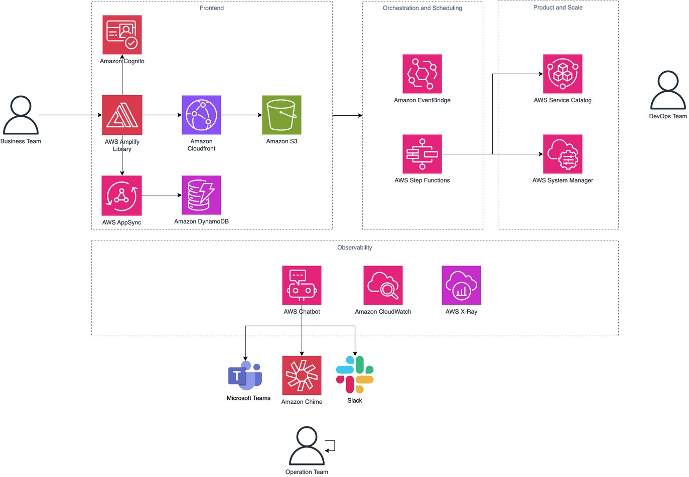
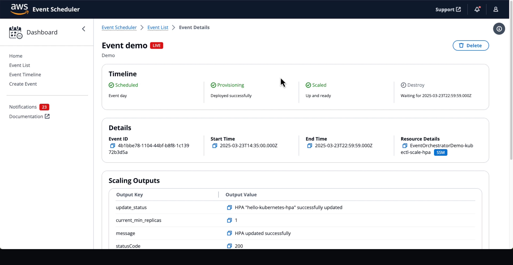

# Event Scheduling Platform on AWS

The Event Scheduling Platform on AWS is a comprehensive solution for managing and automating scheduled events in AWS environments. It provides a robust infrastructure for scheduling, deploying, and monitoring events across various AWS services.

This solution bridges the gap between business and technical teams by automating the provisioning and scaling of cloud resources for scheduled high-traffic events. It eliminates the need for manual intervention, reduces operational overhead, and optimizes resource utilization while ensuring exceptional customer experiences during peak demand periods.

This project combines serverless technologies, including AWS Lambda, Step Functions, EventBridge, and AppSync, to create a flexible and scalable event scheduling system. The platform allows users to define, schedule, and execute complex workflows involving AWS Service Catalog products and Systems Manager (SSM) documents.

## Key Features

- **Event Scheduling**: Create and manage scheduled events with flexible timing options
- **Automated Resource Provisioning**: Automatically provision AWS resources based on event schedules
- **Dynamic Scaling**: Scale resources up and down according to event requirements
- **Service Catalog Integration**: Deploy pre-approved products from Service Catalog
- **SSM Document Execution**: Run Systems Manager documents as part of event workflows
- **Monitoring and Insights**: Track event status and resource utilization
- **Self-Service for Business Teams**: Empowers business users to schedule events without IT tickets
- **Standardized Infrastructure**: Enables DevOps teams to create reusable infrastructure patterns
- **Cost Optimization**: Automatically cleans up resources after events to minimize expenses

## Use Cases

The Event Scheduling Platform on AWS serves various industries with scheduled high-traffic events:

- **Media & Broadcasting**: Automate infrastructure for live streaming events, sports broadcasts, and virtual conferences
- **Retail & E-commerce**: Manage infrastructure for flash sales, product launches, and seasonal promotions
- **Gaming**: Scale resources for game launches, tournaments, and special in-game events
- **Ticketing**: Handle infrastructure needs for high-demand ticket sales and registrations
- **Financial Services**: Support trading platforms during market events and scheduled financial operations

## Target Audience

The solution serves two primary user groups:

### Business Teams
- Product Owners, Event Managers, Marketing Managers, and Operations Managers
- Focus on business KPIs like audience size, event criticality, and performance targets
- Need self-service tools to schedule events without technical expertise

### Technical Teams
- DevOps Engineers, SREs, Cloud Architects, and Infrastructure Managers
- Create standardized, reusable infrastructure patterns
- Implement scaling logic and resource management strategies

## Architecture



## Getting Started

### Prerequisites

- Node.js (v18 or later)
- AWS CLI configured with appropriate credentials
- AWS CDK CLI installed globally (`npm install -g aws-cdk`)
- Task (task runner) installed ([installation guide](https://taskfile.dev/installation/))

### Installation

1. Clone the repository:
   ```bash
   git clone <your-repository-url>
   cd <repository-name>
   ```

2. Install dependencies for all projects:
   ```bash
   task install
   ```

### Deployment

1. Build the core components:
   ```bash
   task build:core
   ```

2. Deploy the infrastructure:
   ```bash
   task deploy:infrastructure
   ```

3. Build and deploy the frontend:
   ```bash
   task build:frontend
   task deploy:frontend
   ```

4. Verify deployment:
   - Check the AWS CloudFormation console to ensure all stacks were deployed successfully
   - Note the CloudFormation outputs which include:
     - Cognito User Pool ID and Client ID for authentication
     - GraphQL API URL for backend communication
     - Frontend website url
   - Create a user account in Amazon Cognito:
     - Navigate to the Amazon Cognito console
     - Select the User Pool created by the deployment (use the CognitoUserPoolId from outputs)
     - Create a new user account with appropriate permissions
   - Access the frontend application using the created credentials


## Available Tasks

Run `task --list` to see all available commands

## Implementation Process

1. **Setup and Deployment**:
   - Clone the repository and install dependencies
   - Deploy the infrastructure using the included Taskfile
   - Configure authentication and access controls

2. **Create and Tag Resources**:
   - DevOps teams create AWS Service Catalog products or AWS Systems Manager Automation documents
   - Define business parameters and implement scaling logic
   - Tag resources with `{"application": "event-scheduling-platform"}` to make them available for orchestration

3. **Schedule Events**:
   - Business teams access the web interface to schedule events
   - Select appropriate products or documents and input business parameters
   - Set event schedules and monitor execution status

4. **Monitor and Optimize**:
   - Use Amazon CloudWatch dashboards to track event execution
   - Receive notifications through AWS Chatbot for any issues
   - Analyze resource utilization to optimize future events

## Sample Resources Deployed with the Platform

The Event Scheduling Platform automatically deploys sample resources to help you get started and understand how the system works. These samples are deployed as part of the [Products CDK Stack](cdk/lib/products-stack.ts) and serve as educational examples.

### Sample SSM Document

**What it does**: A simple automation document that demonstrates the required structure for Event Scheduling Platform integration.

**Location**: `cdk/lib/ssm-documents/sample.yaml`

**How to use**:
1. After deployment, the sample document will be available in AWS Systems Manager
2. It will be automatically tagged with `application=event-scheduling-platform`
3. You can schedule events using this document through the web interface
4. Use it as a template to create more complex automation documents

### SSM Document Requirements

**Important**: All SSM documents used with the Event Scheduling Platform must meet these requirements:

#### Required Parameters
All SSM documents must include these parameters:

```yaml
parameters:
  AutomationAssumeRole:
    type: "AWS::IAM::Role::Arn"
    description: The ARN of the role that allows Automation to perform the actions on your behalf.
  internalAction:
    type: "String"
    default: "preroll"
    description: Internal action type for event orchestration (preroll/postroll)
    allowedValues:
      - "preroll"
      - "postroll"
```

#### Required Output
The workflow expects SSM documents to produce output data. Your document must include at least one step that produces output using the `outputs` section:

```yaml
mainSteps:
  - name: YourFinalStep
    action: aws:executeScript  # or another action that can produce output
    isEnd: true
    inputs:
      # Your step inputs
    outputs:
      - Name: result
        Selector: $.Payload  # or appropriate selector for your action
        Type: StringMap
```

**Why these are required**:
- `AutomationAssumeRole`: Used by the platform to pass the appropriate IAM role for execution
- `internalAction`: Distinguishes between preroll (before event) and postroll (after event) executions
- **Output data**: The Step Functions workflow reads the output to provide feedback and status information

**Example**: See the sample document at `cdk/lib/ssm-documents/sample.yaml` for a complete working example.

### Sample Service Catalog Product

**What it does**: An empty CloudFormation template that serves as a starting point for creating Service Catalog products.

**Components**:
- Portfolio: `Event Scheduling Platform - Portfolio Sample`
- Product: `Event Scheduling Platform - Product Sample`
- Version: `v1` with an empty CloudFormation template

**How to use**:
1. After deployment, the sample product will be available in AWS Service Catalog
2. It will be automatically tagged with `application=event-scheduling-platform`
3. You can provision this product through the web interface (though it creates no resources)
4. Use it as a template to create meaningful Service Catalog products for your use cases

### Building Upon the Samples

These samples demonstrate the complete integration pattern:

1. **Resource Creation**: How to define infrastructure resources
2. **Proper Tagging**: Required tags for platform discovery (`application=event-scheduling-platform`)
3. **IAM Best Practices**: Least privilege implementation with educational examples
4. **Integration**: How resources work with the orchestration workflows

To create your own resources:
1. Follow the tagging pattern shown in the samples
2. Implement least privilege IAM policies as demonstrated in the SSM role
3. Test with the platform's web interface
4. Scale up to more complex automation and infrastructure patterns


## Registering Existing SSM Documents and Service Catalog Products

The Event Scheduling Platform can work with your existing SSM Documents and Service Catalog Products. You don't need to create these resources within the CDK project. Instead, you need to properly tag them and run the registration scripts.

### Simple Registration Process

The platform provides automated scripts that discover and register all properly tagged resources. This eliminates the need to manually register each resource individually.

#### Step 1: Tag Your Resources

**For SSM Documents:**
```bash
aws ssm add-tags-to-resource \
  --resource-type "Document" \
  --resource-id "YourDocumentName" \
  --tags "Key=application,Value=event-scheduling-platform"
```

**For Service Catalog Portfolios:**
```bash
aws servicecatalog create-tag-option \
  --key application \
  --value event-scheduling-platform

# Then associate with your portfolio
aws servicecatalog associate-tag-option-with-resource \
  --resource-id port-xxxxxxxxx \
  --tag-option-id topt-xxxxxxxxx
```

**For Service Catalog Products:**
```bash
# Same tag option as above, then associate with your product
aws servicecatalog associate-tag-option-with-resource \
  --resource-id prod-xxxxxxxxx \
  --tag-option-id topt-xxxxxxxxx
```

#### Step 2: Audit your resource

The Event Scheduling Platform includes a comprehensive auditing script that automatically checks your configuration and identifies common issues.

### Running the audit

```bash
task audit
```

The auditing tool will check:

- **IAM Permissions**: Verifies Step Functions role has all required permissions
- **Service Catalog Setup**: Checks portfolio access, launch constraints, and product configuration
- **SSM Configuration**: Validates SSM document permissions and tagging
- **Resource Tagging**: Ensures all resources have proper tags for platform integration

#### Step 3: Register resources

If you want to register your resources with Infrastructure-as-Code, Inspire with the [Products CDK Stack](cdk/lib/products-stack.ts). If you want to register your resources with the script

```bash
task register
```

### Step 4: Verification

After registration, verify the integration:

1. **Check Platform Discovery**: Your tagged resources should appear in the platform's web interface
2. **Test Provisioning**: Create a test event to ensure Service Catalog products can be provisioned
3. **Monitor Execution**: Check CloudWatch logs for any permission issues during execution

## Monitoring and Cost Optimization

The solution includes comprehensive monitoring through Amazon CloudWatch dashboards that display event execution status, workflow metrics, and resource provisioning status. Notifications are sent through AWS Chatbot (supporting Slack, MS Teams, or Amazon Chime) for rapid issue response.

Cost optimization is achieved through:
- Automatic resource cleanup after events
- Efficient state machine design to minimize transitions
- Reuse of shared components to reduce resource expenses
- Dynamic scaling based on actual event requirements

## Screenshots


## Resource Cleanup

**⚠️ Important**: To avoid ongoing AWS charges, make sure to clean up all resources when you no longer need the Event Scheduling Platform.

Use the provided cleanup task to remove all infrastructure:

```bash
task destroy:infrastructure
```

## Cost Considerations

The following resources may incur ongoing costs:
- **DynamoDB**: Pay-per-request billing for table operations
- **Lambda**: Charged per execution and duration
- **Step Functions**: Charged per state transition
- **AppSync**: Charged per request and data transfer
- **CloudWatch**: Logs storage and custom metrics
- **Cognito**: Active user charges for authentication

## Contributing

Please read [CONTRIBUTING.md](CONTRIBUTING.md) for details on our code of conduct and the process for submitting pull requests.

## License

This project is licensed under the Apache License 2.0 - see the [LICENSE](LICENSE) file for details.